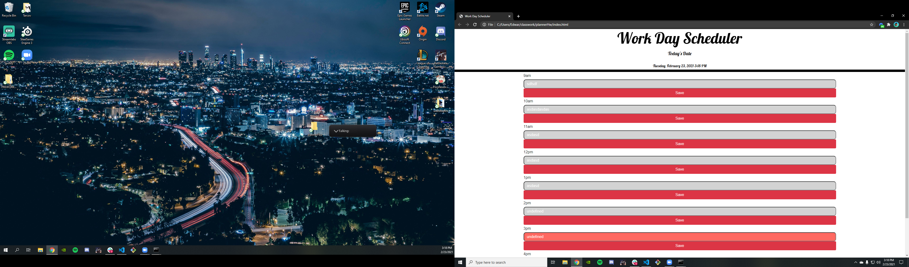

# plannerHw

I made a day planner, with time slots from 9am - 5pm. So you can log in information and see what you have planned throughout the day.
The planner has save buttons so you can save what you wrote. It also displays the correct time on the page, when the user loads it up. I used bootstrap to style most of th page then I used google fonts to change the font of the header to something different. The javaScript I made was simple I made everything into sections so the code would be easier to read with comments so the reader knows what section of the code does what. I also added an event listener to my currentTime function. So it will change the color of the line to RED when it is that time, if the line is green it is referring to the future. If it is grey it is refering to the past.

https://github.com/EdwardArana/plannerHw
https://edwardarana.github.io/plannerHw/

